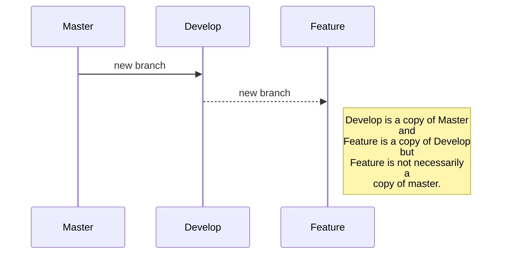

# Git

Git is an open source distributed version control system originally developed by Linus Torvalds. Its distributed architecture allows the working copy of each developer's code to be also a repository that can hold the complete history of all changes, instead of having a single space for the entire software version history.

## Git Commands

To manage projects with Git, there are some basic commands that every developer should know. These are listed below.

### Get Repository

To obtain a repository from remote and clone it in our local computer, we type:

`git clone [https/ssh]`

### Create a new branch

As good practices we must always maintain two branches: **master** and **develop**. In the master branch all the final changes of our project will be displayed and in the develop branch what is being developed. Then all branches will be created from the **develop** branch.

`git checkout -b [branch_name]`

### Add files

Assuming we are developing on the **develop** branch, at the end we must add file contents to the index of git repository, so we type:

`git add .`

### Commit changes

After the file contents have been added, we need to record changes to the repository with the next command:

`git commit -m "New feature added"`

**Note:** We could add a message for the commits with `-m` follow by a description

### Push to remote

After confirming our changes in the local repository, it is necessary to update the main repository remotely, we just type:

`git push`

**Note:** If a new branch has been created and it is not located remotely, we must perform the push as follows `git push --set-upstream origin [branch_name]`

### Delete branch

Sometimes we should delete a branch that is not in use or that is inactive, for this we type:

`git branch -D [branch_name]`

### Merge branch

Once we have finished working on a branch and we want to **merge** into another one, we need first **checkout** to the destination branch and then apply **merge** command:

**Checkout to destination branch**

`git checkout [destination_branch]`

**Merge**

`git merge [origin_branch]`